<div align="center">

# Appui-Design-Skill

**A Codex skill for mobile app UI design with screenshot-backed source code.**<br>
从单屏灵感到多界面主题套件，所有 UI 预览都由仓库中的 HTML/CSS 源码真实渲染。


</div>

<p align="center">
  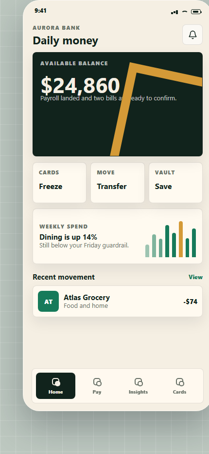
  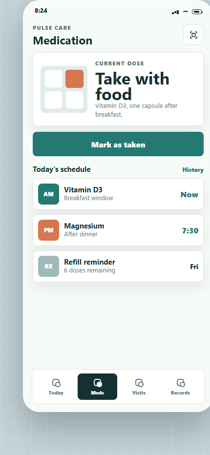
  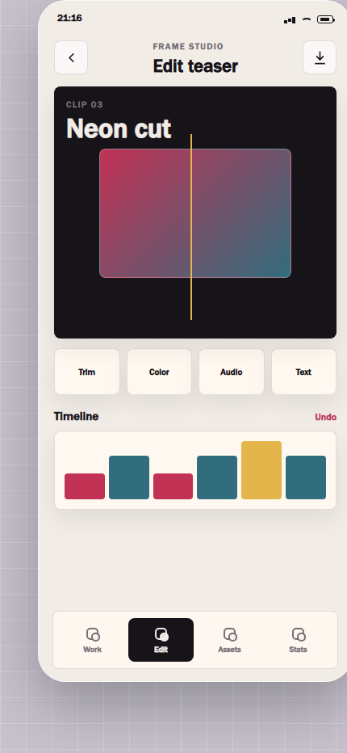
</p>

## What You Get

This repository is more than a prompt note. It is a complete mobile UI design skill plus a reproducible example library:

| Layer | Included |
|---|---|
| Codex skill | `SKILL.md` and `agents/openai.yaml` |
| Design playbook | `references/app-ui-playbook.md` |
| 10 single-screen app UI cases | `cases/*/index.html` and `assets/previews/*.png` |
| 5 multi-screen app themes | `themes/*/*.html` and `assets/theme-previews/*.png` |
| Screenshot generation | `scripts/render-previews.mjs` |
| Source-preview verification | `scripts/verify-assets.mjs` |

## Theme Suites

Each theme shows one app across multiple functional screens. The UI image and source link in every cell point to the same screen.

### Aurora Bank

Consumer finance app with home balance, transfer, and spending intelligence.

| Home | Transfer | Insights |
|---|---|---|
|  | 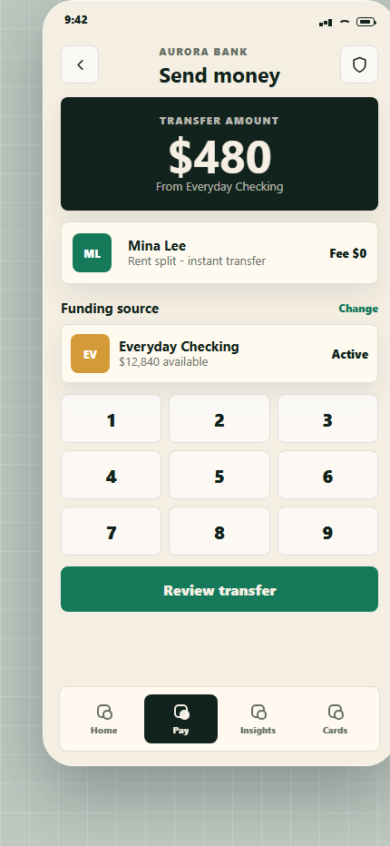 | 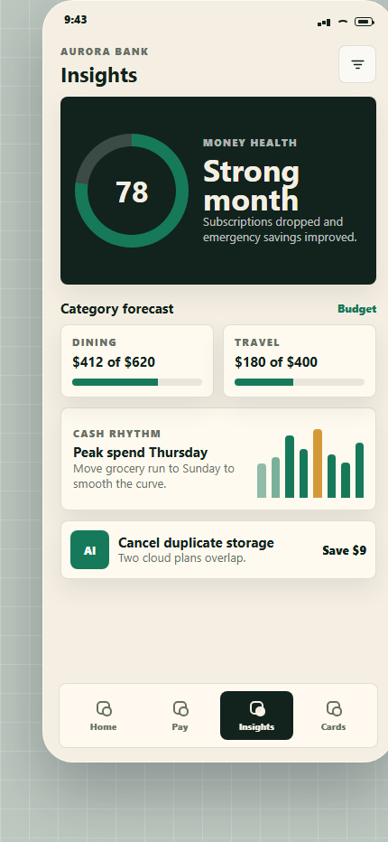 |
| [`home.html`](themes/01-aurora-bank/home.html) | [`transfer.html`](themes/01-aurora-bank/transfer.html) | [`insights.html`](themes/01-aurora-bank/insights.html) |

### Pulse Care

Healthcare companion with daily status, medication adherence, and visit prep.

| Overview | Medication | Visit |
|---|---|---|
| 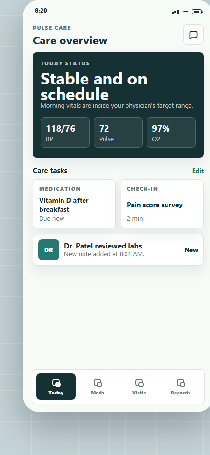 |  | 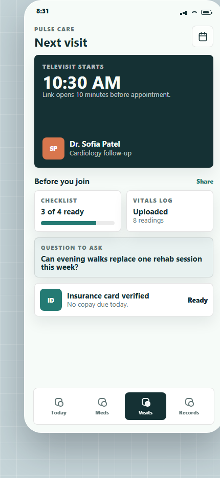 |
| [`overview.html`](themes/02-pulse-care/overview.html) | [`meds.html`](themes/02-pulse-care/meds.html) | [`visit.html`](themes/02-pulse-care/visit.html) |

### Nomad Trip

Travel planning app with local discovery, itinerary, and offline wallet pass.

| Discover | Itinerary | Pass |
|---|---|---|
| 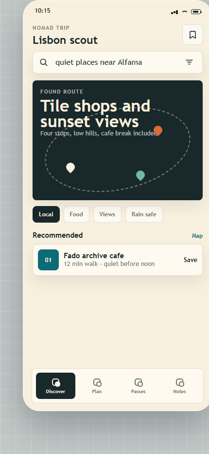 | 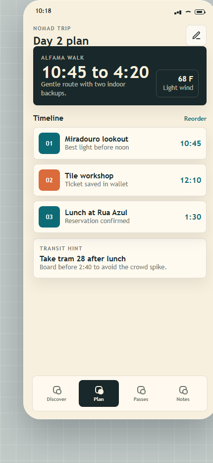 | 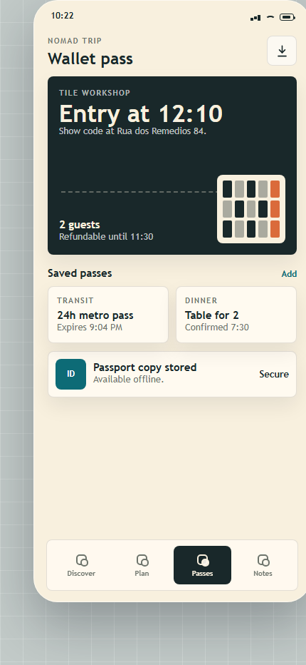 |
| [`discover.html`](themes/03-nomad-trip/discover.html) | [`itinerary.html`](themes/03-nomad-trip/itinerary.html) | [`pass.html`](themes/03-nomad-trip/pass.html) |

### Bento Market

Food delivery app with discovery, restaurant menu, and checkout flow.

| Discover | Menu | Checkout |
|---|---|---|
| 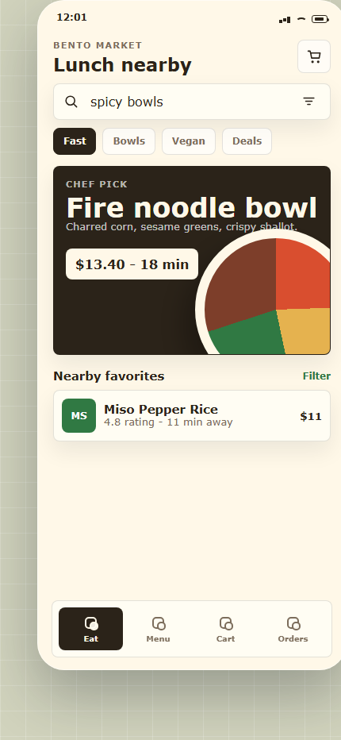 | 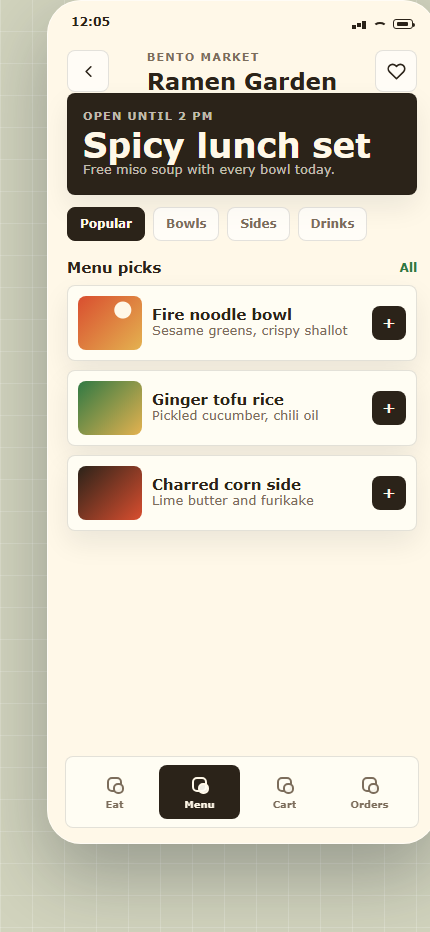 | 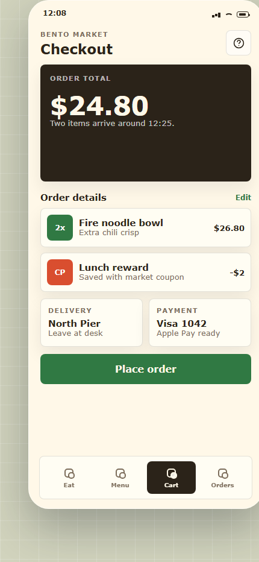 |
| [`discover.html`](themes/04-bento-market/discover.html) | [`menu.html`](themes/04-bento-market/menu.html) | [`checkout.html`](themes/04-bento-market/checkout.html) |

### Frame Studio

Creator workflow app with project hub, video editor, and campaign analytics.

| Projects | Editor | Analytics |
|---|---|---|
| 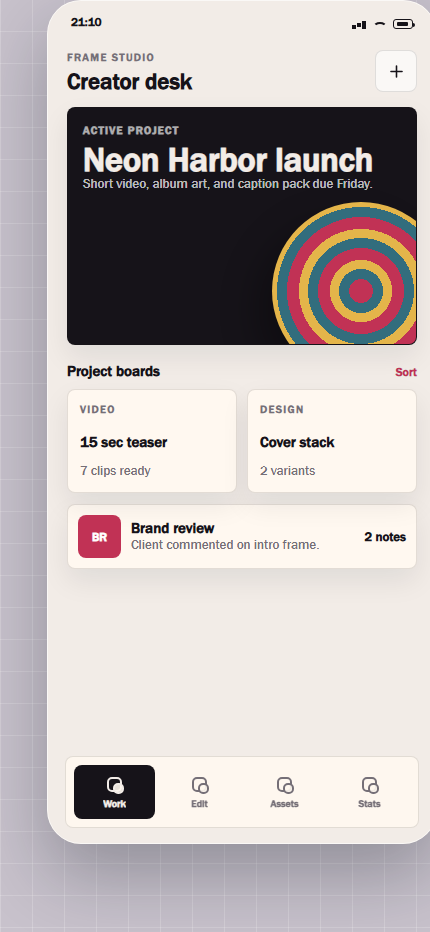 |  | 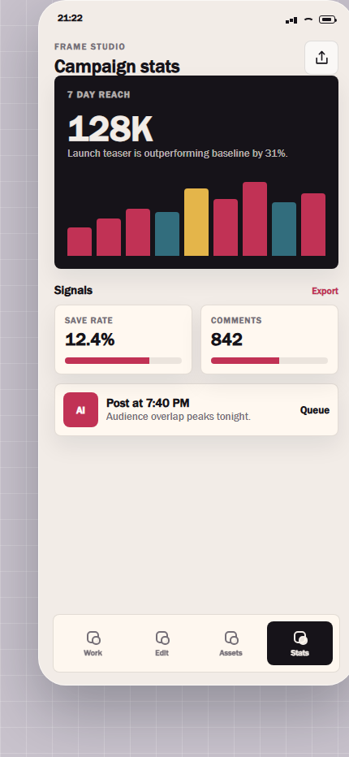 |
| [`projects.html`](themes/05-frame-studio/projects.html) | [`editor.html`](themes/05-frame-studio/editor.html) | [`analytics.html`](themes/05-frame-studio/analytics.html) |

## Single-Screen Case Gallery

The original case gallery is kept as a fast inspiration library. These are standalone app screens across different domains and information densities.

| Preview | Case | Product Pattern | Source |
|---|---|---|---|
| 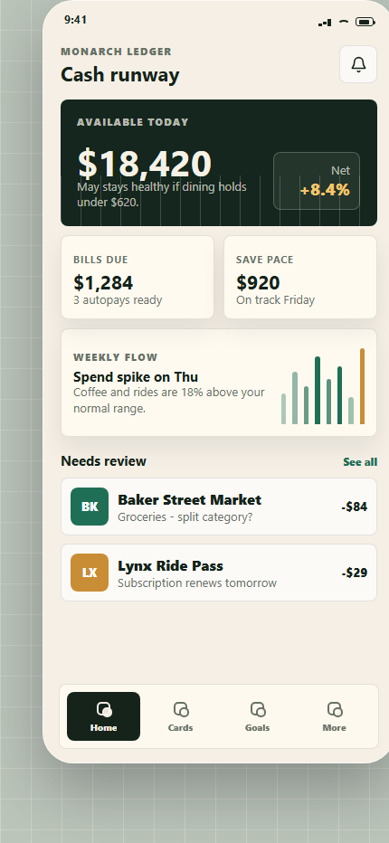 | **Finance Command** | Personal finance dashboard with spend review and cash flow | [`index.html`](cases/01-finance-command/index.html) |
| 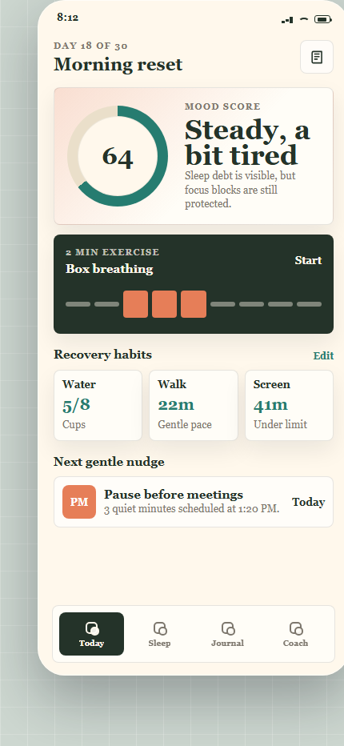 | **Wellness Rhythm** | Mood check-in, habit recovery, and gentle coaching | [`index.html`](cases/02-wellness-rhythm/index.html) |
| 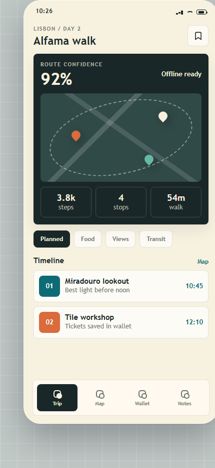 | **Travel Scout** | Trip route, map context, and itinerary timeline | [`index.html`](cases/03-travel-scout/index.html) |
| 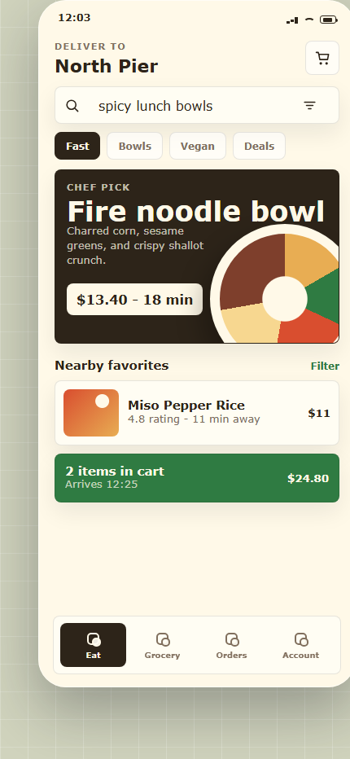 | **Food Market** | Restaurant discovery, search chips, and cart intent | [`index.html`](cases/04-food-market/index.html) |
| 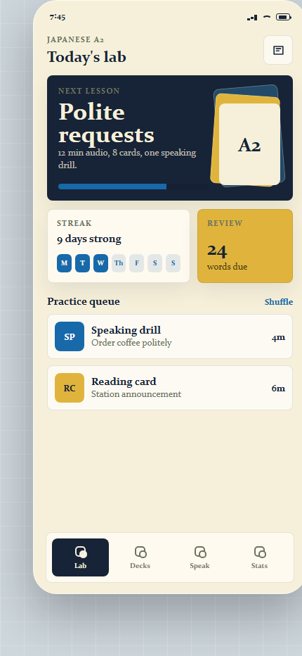 | **Learning Lab** | Lesson progress, practice queue, and streak state | [`index.html`](cases/05-learning-lab/index.html) |
| 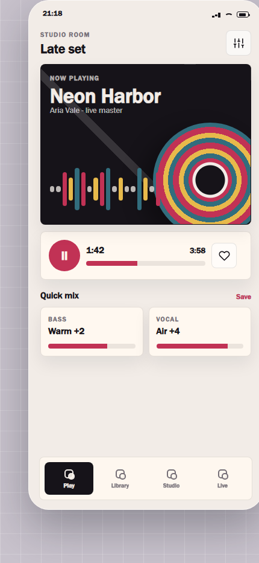 | **Music Studio** | Player, waveform, and quick mix controls | [`index.html`](cases/06-music-studio/index.html) |
| 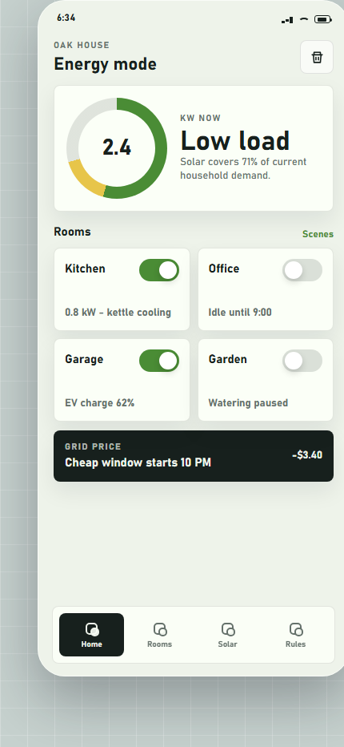 | **Home Energy** | Energy gauge, smart room controls, and grid price | [`index.html`](cases/07-home-energy/index.html) |
| 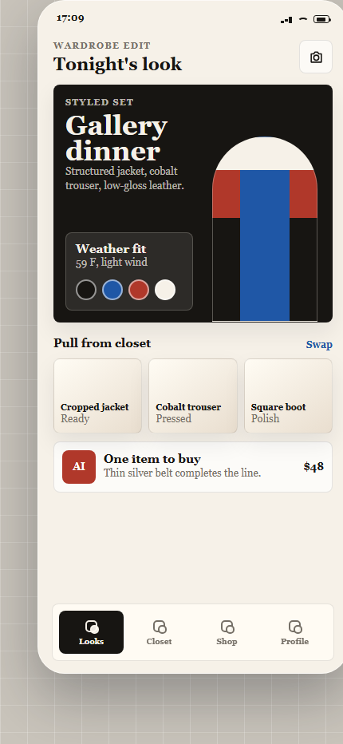 | **Fashion Wardrobe** | Outfit planning, closet sourcing, and commerce hint | [`index.html`](cases/08-fashion-wardrobe/index.html) |
| 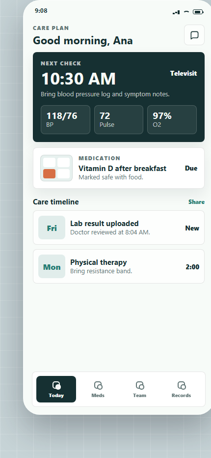 | **Medical Companion** | Care plan, vitals, medication, and appointment state | [`index.html`](cases/09-medical-companion/index.html) |
| 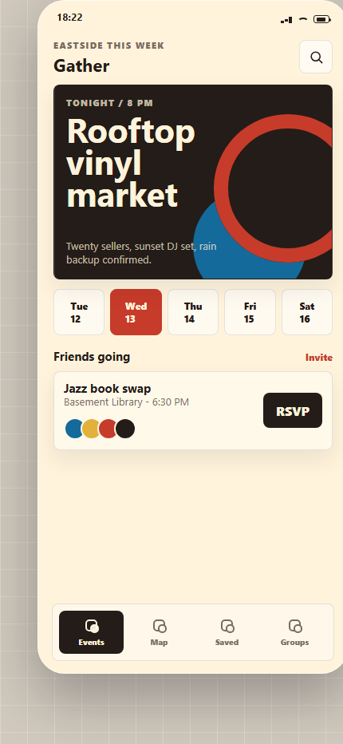 | **Social Events** | Event discovery, date filtering, and RSVP action | [`index.html`](cases/10-social-events/index.html) |

## Use As A Codex Skill

Clone into your Codex skills directory:

```bash
git clone https://github.com/Just-Agent/Appui-Design-Skill ~/.codex/skills/appui-design-skill
```

Then invoke it with prompts like:

```text
Use $appui-design-skill to design a finance app dashboard with screenshots and source code.
```

```text
Use $appui-design-skill to create a multi-screen mobile app theme for a travel planner.
```

## Regenerate And Verify

The preview images are generated from the HTML source using installed Chrome or Edge. No npm dependencies are required.

```bash
node scripts/render-previews.mjs
node scripts/verify-assets.mjs
```

Current verification target:

| Asset Type | Count |
|---|---:|
| Single-screen cases | 10 |
| Multi-screen theme screens | 15 |
| Total rendered UI previews | 25 |

## Repository Map

```text
Appui-Design-Skill/
├─ SKILL.md
├─ agents/openai.yaml
├─ references/
│  ├─ app-ui-playbook.md
│  ├─ case-catalog.md
│  └─ research-notes.md
├─ cases/
│  ├─ shared/app-ui.css
│  └─ 01-finance-command ... 10-social-events/
├─ themes/
│  ├─ shared/theme-ui.css
│  └─ 01-aurora-bank ... 05-frame-studio/
├─ assets/
│  ├─ previews/
│  └─ theme-previews/
└─ scripts/
   ├─ render-previews.mjs
   └─ verify-assets.mjs
```

## Research Foundation

The skill uses platform guidance and current UI pattern research as constraints, then creates original screens around real product flows.

- [Apple Human Interface Guidelines](https://developer.apple.com/design/human-interface-guidelines)
- [Apple Layout guidance](https://developer.apple.com/design/Human-Interface-Guidelines/layout)
- [Android adaptive layouts](https://developer.android.com/develop/ui/compose/layouts/adaptive)
- [Android adaptive apps](https://developer.android.com/adaptive-apps)
- [Material Design navigation bar](https://m3.material.io/components/navigation-bar/overview)
- [Awwwards Mobile UI collection](https://www.awwwards.com/awwwards/collections/mobile-ui/)
- [Mobbin overview example](https://www.ui-tools.com/product/mobbin)

## License

MIT. Use the skill, remix the cases, and adapt the workflow for your own app UI projects.
